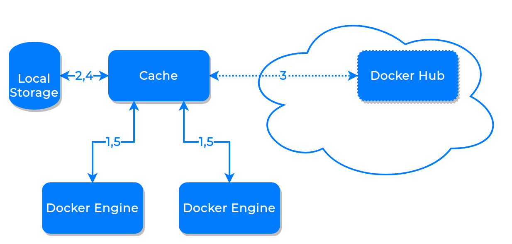
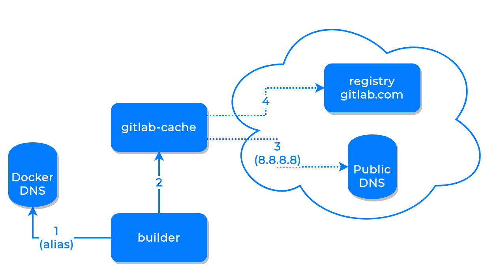

name: empty
layout: true
---
name: base
layout: true
template: empty
background-image: none
<div class="slide-footer">@sudo_bmitch</div>
---
name: title
layout: true
template: empty
class: center, middle
background-image: url(img/dc2020-title-bg.png)
background-size: cover
---
name: inverse
layout: true
template: base
class: center, middle, inverse
background-image: url(img/dc2020-white-bg.png)
background-size: cover
---
name: impact
layout: true
template: base
class: center, middle, impact
background-image: url(img/dc2020-bg4.png)
background-size: cover
---
name: picture
layout: true
template: base
class: center, middle
background-image: none
---
name: terminal
layout: true
template: base
class: center, middle, terminal
background-image: url(img/dc2020-code-bg.png)
background-size: cover
---
name: default
layout: true
template: base
background-image: url(img/dc2020-bg2.png)
background-size: cover
---
layout: false
template: default
name: agenda

# Agenda

.left-column[
- [Caching](#caching)
- [Caching Demos](#demo1)
- [Caching Limitations](#cache-limitations)
- [Caching Other Registries](#other-registries)
]
.right-column[
- [Caching Gitlab Demo](#demo7)
- [Mirroring](#mirroring)
- [Manual Mirroring](#manual-mirror-reasons)
- [Summary](#summary)
]

---
template: title

.left-40-column[
.pic-circle-70[]
]
.right-60-column[.align-left[.no-bullets[
# Docker Registry Mirroring and Caching
### Brandon Mitchell
Twitter: @sudo_bmitch <br>
GitHub: sudo-bmitch
]]]
???
- First a bit of housekeeping:
  - This presentation is on github including all the demos
  - A link to that repo is my pinned tweet on Twitter
  - My twitter handle is at the bottom of most slides
  - So if you miss anything, go back at your own pace

---
template: impact

# Ephemeral Build Server?

---
template: impact

# Cluster Pulling Remote Images?

---
template: impact

# Worry About Upstream Image Changes?

---
template: impact

# Build Infrastructure Tolerant of Upstream Outages?

---

# Outages Happen

- Network Cut
- BGP Routing
- S3

???

- Several years ago, ship anchors cutting undersea cables were common
- Lately bad BGP data causes us to route all traffic to some misconfigured ISP, and showing us how much we depend on CDNs like CloudFlare
- AWS's S3 outage showed how much everything depends on it
- Outages happen all the time, but they are often short lived and only impact a small slice of users

---

class: center

# Production Resilience

.pic-80[.pic-rounded-10[]]

<sub>https://docs.docker.com/engine/swarm/how-swarm-mode-works/nodes/</sub>

???

- In production, we get fault tolerance by running multiple replicas, spreading the load into multiple AZ's, horizontally scaling
- For our build systems, we can add resilience from upstream outages with local mirrors of those resources

---

template: impact

# Faster Builds and Less Bandwidth

???

- This added resilience comes with a side benefit, our builds can run faster, and we can spend less time and money on bandwidth

---

template: inverse

# Registry Mirroring and Caching

???

- If you haven't already guessed by the title or this intro, we're going to talk about how registry mirroring and caching can help

---

template: default

```no-highlight
$ whoami
- Solutions Architect @ BoxBoat
- Docker Captain
- Frequenter of StackOverflow
```

.align-center[
.pic-30[]
.pic-30[]
.pic-30[]
]

???

- Who am I?
  - By day I'm a consultant that helps paid clients transition to containers, 
  - In my downtime I answer questions on StackOverflow
  - Helping to spread knowledge about Docker through StackOverflow and presentations like this was my path to the Captains program
  - Captains is a community evangelists program of non-employees, paid in swag and a bit of access to insiders
  - Other captains got into the program by writing books, creating training content, blogs, videos, podcasts, etc

---

template: inverse
name: caching

# Caching

---

class: center

# Caching is the Easy Button

.pic-40[.pic-rounded-20[]]

<sub>https://commons.wikimedia.org/wiki/File:Easy_button.JPG</sub>

???

- The reason I start with caching is because it's the easy option
- There's much less to maintain, it recovers easily from any issues
- And docker falls back nicely should the cache become unavailable

---

class: center

# Cache Architecture

.pic-80[.pic-rounded-10[]]

???

- The cache sits between the local docker engine and your external registry
- You want to configure local filesystem storage, though that isn't required
- When the engine pulls an image (1), it checks for the image layers locally (2)
- If those layers aren't local, it pulls from the upstream registry (3)
- Those layers are then added to the local storage cache (4) and returned to the engine (5)
- With multiple engines pulling similar images, you eliminate duplicate layer pulls to the upstream registry (3)
- This could be multiple nodes in a cluster/office/datacenter/VMs
- Or it could be ephemeral build engines that create an empty DinD instance for each build

---

# Cache Implementation

Either the dockerd CLI:

```no-highlight
dockerd --registry-mirror <cache-url>
```

Or /etc/docker/daemon.json

```no-highlight
{ "registry-mirrors": [ "<cache-url>" ] }
```

Plus a registry:

```no-highlight
docker run -e REGISTRY_PROXY_REMOTEURL=<upstream-url> registry:2
```

???

- You need two things for the cache:
  1. Point the docker engine to that cache with the registry-mirrors setting
     - Either on the CLI or in the daemon.json file
  2. Run a registry with the pull through cache configuration
     - `registry:2` includes this with a config file or env var

---

template: terminal
name: demo1
class: center

<asciinema-player src="demo-1-registry-mirror-flag.cast" cols=100 rows=26 preload=true font-size=16></asciinema-player>

???

- Lets start by creating a registry instance and pointing the docker engine to it
- Use a shared user created network to communicate between containers
- Give each container a name so we can use DNS resolution
- The DinD container passes flags in the CMD to dockerd
- If we exec into the container and try to pull
- ... it fails. We need to configure the registry as a pull through cache still...

---

template: terminal
name: demo2
class: center

<asciinema-player src="demo-2-proxy-arg.cast" cols=100 rows=26 preload=true font-size=16></asciinema-player>

???

- To configure that pull through cache, lets replace the old container
- Add a volume for the local storage and an env config to use it
- Add an env to point to the docker hub registry

---

template: terminal
name: demo3
class: center

<asciinema-player src="demo-3-time-diff.cast" cols=100 rows=26 preload=true font-size=16></asciinema-player>

???

- Lets compare the speedup vs pulling over my home network here
- First I'm pulling a new image
- Next, lets stop and replace that DinD instance, as if we used an ephemeral builder
- Pull again and we can see how much faster that second pull runs

---

template: terminal
name: demo4
class: center

<asciinema-player src="demo-4-priv-repo.cast" cols=100 rows=26 preload=true font-size=16></asciinema-player>

???

- Does this work with private repos?
- We can login and push to a private repo, but this is a pull through cache, not a push through
- Pulling fails, we need to update the registry configuration
- Updating the registry with credentials involves a few more env vars, use 2fa and a token
- Now we can pull that image, and running a second time shows that speedup still works
- Also, that second pull in the clean DinD instance, note that we never logged in

---

template: terminal
name: demo5
class: center

<asciinema-player src="demo-5-tls.cast" cols=100 rows=26 preload=true font-size=16></asciinema-player>

???

- What if we pull directly from the cache? Oops, insecure registry
- Lets create a cert with the cache name
- Stop/remove everything to recreate
- Recreate the registry container with the cert/key mounted and env to use the cert
- Recreate the DinD instance to trust that cert
- Doh, can't do a volume mount with a colon in the path, switch to the mount syntax
- Now pull images directly, /ubuntu doesn't work, the private one does, hmm
- We need `/library/ubuntu` since that's the underlying path of the official images

---

template: terminal
name: demo6
class: center

<asciinema-player src="demo-6-compose.cast" cols=100 rows=26 preload=true font-size=16></asciinema-player>

???

- Those CLI options are getting ridiculous, converting to compose is easy enough
- Lets try scaling the builders, each pulling from the same cache

---

template: inverse
name: cache-limitations

# So What's the Catch?

---

# Cache Limitations

- The "registry-mirror" setting only applies to Docker Hub
- Only caches pulls not pushes
- Pulls still check the image manifest on Hub
- Credentials are in the cache server
- Docker implementation only supports one authentication method

???

- Only applies to docker hub, but we can workaround this
- No push caching means you always need one pull after the push to populate the cache
- If you still check docker hub, unplanned changes upstream, or an outage, still breaks your build
- Credentials to private repos means any user with access to the cache can pull your private images
- Dockers registry auth method is bearer tokens, doesn't work with basic auth

---

name: other-registries

# Options to Cache Other Registries

- Configure a squid HTTP caching proxy
- Pull directly from the cache
- Use DNS and TLS certs to send pulls to the proxy

---

template: terminal
name: demo7
class: center

<asciinema-player src="demo-7-gitlab-cache.cast" cols=100 rows=26 preload=true font-size=16></asciinema-player>

???

- First, lets see how we can pull directly from a cache, we did this with hub already
- When we push an image, it needs to push directly to gitlab
- When we pull, we need to specify the cache name for the registry, and then the repo

---

# Intercepting DNS

```no-highlight
version: '3.7'
services:
  gitlab-cache:
    image: registry:2
    networks:
      cache:
*       aliases:
*       - registry.gitlab.com
    dns:
*   - 8.8.8.8
*   - 8.8.4.4
```

---

class: center

# Intercepting DNS

.pic-80[.pic-rounded-10[]]

???

- With that alias and DNS that we did in the compose file, we get this
- The builder queries docker's DNS and sees the network alias since they are on the same docker network
- The gitlab-cache container uses the external DNS and talks to the real registry.gitlab.com
- If the cache container goes away, so does the network alias, and the builder can talk directly to gitlab

---

template: terminal
name: demo8
class: center

<asciinema-player src="demo-8-gitlab-dns-tls.cast" cols=100 rows=26 preload=true font-size=16></asciinema-player>

???

- The first thing we need to do is setup the TLS certificate so docker trusts our cache with the new hostname
- Then we use the DNS settings in the compose file to send requests to our container
- And in the builder we include the certificates in the certs.d directory so it trusts them
- Start up both the cache and builder
- Exec into the builder, and run our pull
- But a push will fail since you can't push through the cache
- Stop the cache and we can still pull, also push works again since we are talking directly to gitlab now

---

template: impact

# I Want More

???

- That enables us to use a different upstream registry
- But there were other issues:
  - Credentials in the cache server
  - Upstream changes breaking the builds (don't use "latest")
  - Upstream outages breaking the builds

---

template: impact
name: mirroring

# Mirroring

???

- Mirroring solves these
- Instead of running a pull through cache, we run a local registry
- We push the images we need to that registry
- And then use that registry for all builds and deploys locally

---

# Running a Registry

- Docker image

```no-highlight
docker container run -p 5000:5000 registry:2
```

- Harbor
- Many Artifact Repositories

???

- You can easily run your own registry
- Docker includes an image for the minimal API, there are lots of options to configure it like we've seen to configure it as a pull through cache
- Harbor is a CNCF project that includes features many want with a registry (user management, vulnerability scanning)
- The API is an open spec so many other artifact repositories include a docker registry option (Nexus, Artifactory)

---

# Manually Mirroring

```no-highlight
docker image pull ${image}
docker image tag ${image} local-mirror:5000/${image}
docker image push local-mirror:5000/${image}
```

???

- Populating a mirror with content involves:
  - a pull from upstream
  - retag with the local registry name
  - a push of that tag to your local mirror
- My own command for this is a bit more complicated...

---

# Manual Mirror Script

```no-highlight
docker image pull "$localimg"
docker image pull "$remoteimg"

remoteid=$(docker image inspect "$remoteimg" --format '{.Id}')
localid=$(docker image inspect "$localimg" --format '{.Id}')

if [ "$remoteid" != "$localid" ]; then
  docker image tag "$localimg" "$localimg.$datestamp"
  docker image tag "$remoteimg" "$localimg"
  docker image push "$localimg.$datestamp"
  docker image push "$localimg"
fi
```

???

- A more complicated version pulls both, local first since shared layers will go over the faster connection
- Compares the image id's from each image
- And if they are different, it backs up the old image before replacing the tag in the local registry
- In this case I'm using a date stamp, but that could be a job number in your CI system for easier backout options

---

template: inverse
name: manual-mirror-reasons

# Why All the Complication?

???

- So this is no longer the easy button
- You've now got a CI job or something running a shell script
- You need to have that list of images in advance
- Why not use one of the easier options?

---

# Advantages of Manually Mirroring

- Over Automatically Syncing Repos:
  - Changes to images happen on your schedule
  - Backout option exists with breaking changes

- Over Pull Through Cache
  - Those reasons plus...
  - Pushing locally built images to the registry
  - Upstream outage doesn't stop local builds/deploys

???

- There are automatic mirroring options out there, Harbor has one built in to their registry, it's very nice, but I don't use it
  - Controlling when changes happen is huge, if someone pushes an upstream change on Friday afternoon, maybe you don't want to build with that upstream image until Monday morning
  - If someone replaces a tag upstream, and you mirror that change, you have no easy backup. With a script that backup is in the registry with another tag. We can revert the update, or attempt to build an image in dev with a backup tag to debug an issue.
- All those reasons apply to pull through caches too, plus...
  - We can push our local images to a local registry acting as a mirror, with different image names/repos
  - The biggest reason of all... upstream outages don't break our builds and deploys

---

# Risks of Manually Mirroring

- Images go stale if you do not automate the script
- Adding new images is an added process
- Recovering from an outage requires populating images
- FROM line in images needs to point to mirror

```no-highlight
ARG REGISTRY=docker.io
FROM ${REGISTRY}/alpine:3.9
...
```

```no-highlight
docker build --build-arg REGISTRY=local-mirror:5000 .
```

???

- I've seen too many clients that pull the base image once and never update it, that introduces security risks, and developers just don't like you when they realize their issues were from an ancient base image
- I avoid stale images by automating my update script in the CI pipeline, pick a schedule that makes sense to you, beginning of a sprint, Monday morning, daily
- Adding new images to the mirror is an extra step, but it's a git repo that devs can submit PRs. This is easier to enforce if the developers build server doesn't talk to outside registries directly.
- With a cache, recovering is an rm on the volume and restart, it will self populate. A mirror isn't that easy, you need to push those images to the mirror again after an outage. What kinds of failures do I see? Typically storage related, full drive or failing raid.
- In the FROM lines, I recommend a build arg to allow the registry name to be easily changed, and default to the upstream public location. Then the CI workflow overrides the registry value to point to the local mirror for all images.
- To simplify your life, make the mirror's repo layout align with the upstream image names. This allows easily swapping of the registry server with only a single variable change, instead of a variable per image. (Learn from my mistakes.)
- Regardless of what option to pick here, the mirror or cache should be running outside of your pipeline as a long running service, or at least using a persistent volume. If your build pipeline is ephemeral, it doesn't help to point to an ephemeral cache. For deploys, you want the mirror/cache near the cluster you're deploying into.

---

name: summary

# Summary

.left-column[
## Pull Through Cache
- Easy to create
- Saves bandwidth
- Little maintenance
]
.right-column[
## Managed Mirror
- Management overhead
- Control changes
- Tolerate upstream outages
]

---

template: title
name: thanks

# Thank You

.no-bullets[
- github.com/sudo-bmitch/presentations
]

.content[
.left-column[
.pic-80[]
]
.right-column[.align-right[.no-bullets[
<br>
- Brandon Mitchell
- Twitter: @sudo_bmitch
- GitHub: sudo-bmitch
]]]
]
